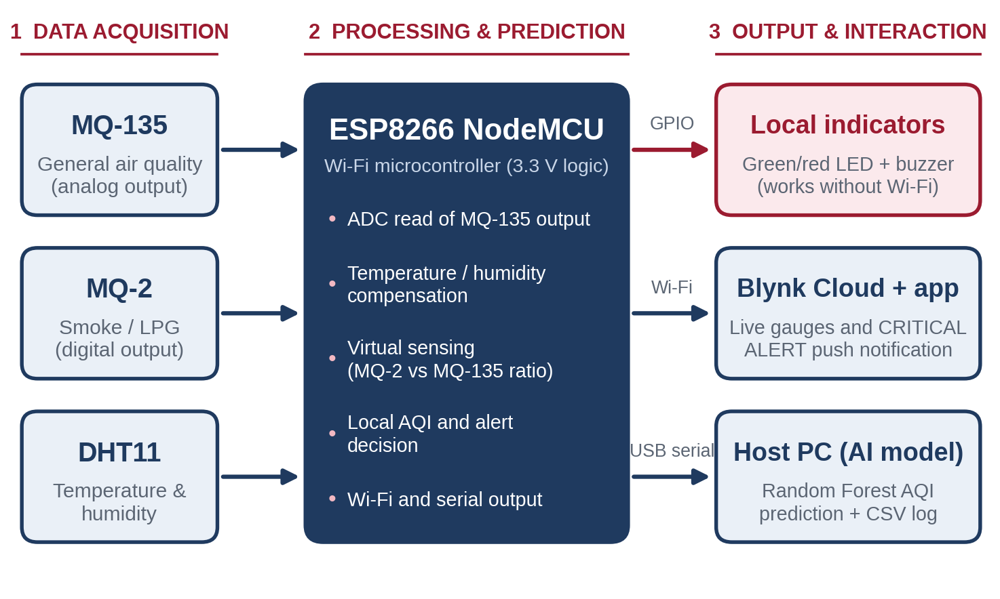
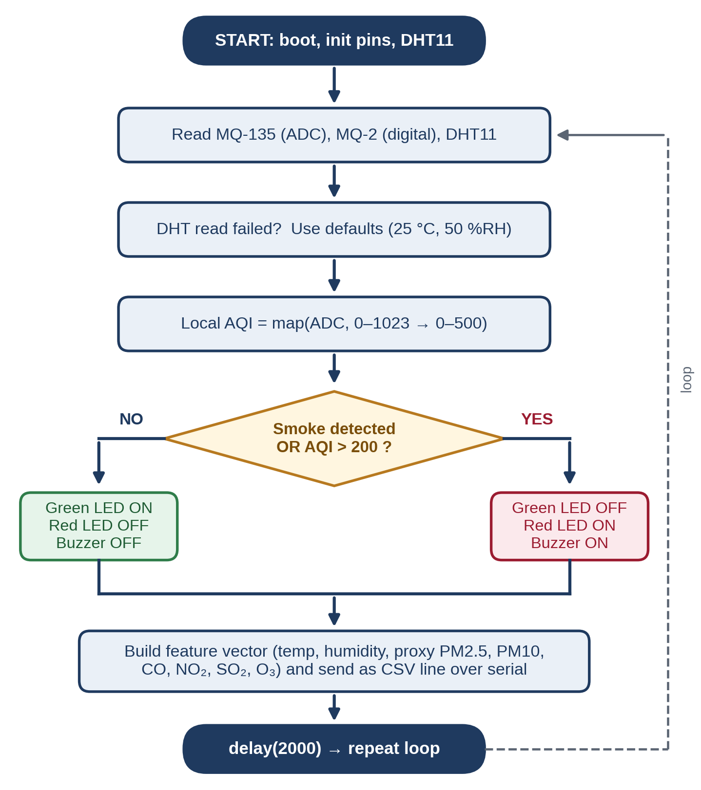
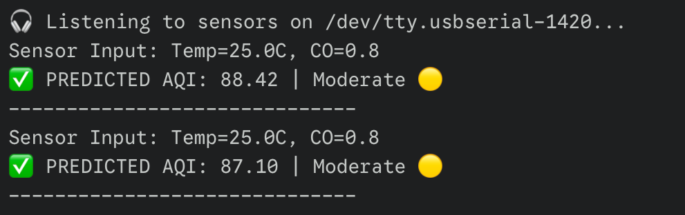

# AI-Reinforced Air Quality Index (AQI) Sensor Module

Cost-effective environmental monitoring using **virtual sensing** on an ESP8266, with a Random Forest model for AQI prediction.

Project for *Embedded System & IoT (UEE511)*, Department of Electrical & Instrumentation Engineering, Thapar Institute of Engineering & Technology, Patiala (July–December 2025).

The full project report is in [`AQI_Sensor_Module_Project_Report.pdf`](./AQI_Sensor_Module_Project_Report.pdf).



## Idea

Measuring several gases normally needs one sensor per gas. This project uses a minimal sensor array and lets software estimate the rest:

- **MQ-135** for general air quality (analog)
- **MQ-2** for smoke / LPG (digital flag)
- **DHT11** for temperature and humidity

An **ESP8266 NodeMCU** reads the sensors, drives local LED/buzzer alerts (no Wi-Fi needed), and streams a feature vector over USB serial to a Python application that predicts the AQI with a **Random Forest** model and logs it.

## How it works

1. **Firmware** (`firmware/`) reads the sensors every 2 s, maps the MQ-135 reading to a local AQI (0–500), and turns on the red LED and buzzer if MQ-2 detects smoke or the local AQI exceeds 200 (otherwise the green LED stays on).
2. The firmware sends one CSV line per cycle: `Temp,Hum,PM25,PM10,CO,NO2,SO2,O3` at 9600 baud.
3. **Host app** (`host/`) trains a `RandomForestRegressor` (100 trees) on `AQI_Prediction_IoT_50.csv`, predicts the AQI for each incoming line, labels it (Good ≤ 50, Moderate ≤ 100, otherwise Unhealthy) and appends it to `aqi_history.csv`.



> **Note on the model inputs:** only temperature and humidity are measured directly. The other six inputs (PM2.5, PM10, CO, NO₂, SO₂, O₃) are estimated in firmware from the MQ-135 reading, so predictions are indicative and not reference-grade. Calibrating against a reference monitor is listed as future work in the report.

## Hardware

| Part | Notes |
|---|---|
| ESP8266 NodeMCU | 3.3 V logic, Wi-Fi, 10-bit ADC on A0 |
| MQ-135 | analog output to A0 through a voltage divider (2.2 kΩ / 3.3 kΩ) |
| MQ-2 | digital output (DO) to D7 |
| DHT11 | data to D2 |
| Green LED, red LED, buzzer | D1, D4, D6 |

| Signal | NodeMCU pin | GPIO |
|---|---|---|
| MQ-135 AO | A0 | ADC0 |
| MQ-2 DO | D7 | GPIO13 |
| DHT11 data | D2 | GPIO4 |
| Green LED | D1 | GPIO5 |
| Red LED | D4 | GPIO2 |
| Buzzer | D6 | GPIO12 |

The whole module runs from a single 5 V USB supply; the NodeMCU regulates 3.3 V on board.

The wiring diagram is in [`images/wiring-diagram.png`](images/wiring-diagram.png). Note that it was drawn with a DHT22 and an ESP32-style board symbol; the built prototype uses a NodeMCU ESP8266 and a DHT11.

## Getting started

### Firmware

1. Install the [Arduino IDE](https://www.arduino.cc/en/software) and add the **ESP8266 board package**.
2. Install the **DHT sensor library** (Adafruit) and its dependency **Adafruit Unified Sensor** from the Library Manager.
3. Open `firmware/aqi_sensor_module/aqi_sensor_module.ino`, select the board (*NodeMCU 1.0 (ESP-12E Module)*) and upload.

### Host application

```bash
cd host
python -m venv .venv
source .venv/bin/activate        # Windows: .venv\Scripts\activate
pip install -r requirements.txt
```

1. Put `AQI_Prediction_IoT_50.csv` in the folder you run the script from. It needs a header row and nine columns in this order: `Temp, Hum, PM25, PM10, CO, NO2, SO2, O3, AQI`.
2. Set `ESP_PORT` in `aqi_host.py` to your serial port (for example `COM3` on Windows or `/dev/ttyUSB0` on Linux).
3. Close the Arduino Serial Monitor (it holds the port), then run:

```bash
python aqi_host.py
```

Example output:



## Blynk / cloud alerts

The report describes push notifications through the Blynk IoT platform (`BlynkSimpleEsp8266`, `Blynk.virtualWrite(V1, aqi_value)` and `Blynk.logEvent("gas_alert")`). The firmware in this repository covers the local alerts and serial streaming only; the Blynk integration is not included here yet.

